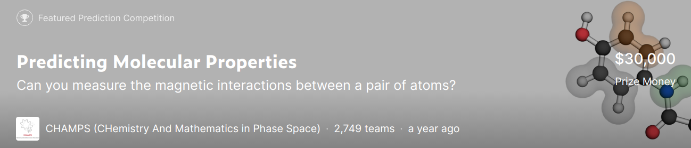

# [Kaggle]Predicting Molecular Properties
[Predicting Molecular Properties \| Kaggle](https://www.kaggle.com/c/champs-scalar-coupling/overview)

- To do
  - [x] scaler_couplint_contributions.csv 内の特徴量	atom_index_0	atom_index_1	type	fc	sd	pso	dsoについて理解する。
  - [x] type の 2JHCとかの意味について理解する。
  - [ ] C,H,N,O,FのNMRパラメータについて理解する。
  - [x] Fは、trainとtestに入っているの？
    - ---> 入ってない 
  - [x] typeごとで学習するというのは、どうだろうか
  
  - [x] なぜ、atomはワンホットではないのか？(typeはそうなのに..)
    - ---> とくに理由はないかも。 決定木系のモデルだと関係ないはず。 使ってみる　　
  - [x] 原子ごとではなく、分子ごとに学習すべき！と思ったら、やってくれてた人いた。([Brute force feature engineering \| Kaggle](https://www.kaggle.com/artgor/brute-force-feature-engineering))
  - [x] molecule ごとの特著料作ったけど、実際どうなってるのか、可視化してみる。(nb14のデータを使用)
  - [x] meta data 使ってみる(ref: [Using meta-features to improve model \| Kaggle](https://www.kaggle.com/artgor/using-meta-features-to-improve-model))
  - [x] error の定義
  - [x] std の特徴量やっぱり抜かしたほうがいいかな...。ひとつでもNaNがある特徴量は生成しなしようにしよう。NaNがある行が削除されていまう。
  - [ ] 分子単位でNがあるかないか、Fがあるのかないのかなども特徴量になりえるのでは？
  - [x] reduce_mem_usage を理解し、実装する
  - [x] いろんな特徴量作っているカーネル見つけた。いろんなカーネルを参考にしたみたい。細かく刻んでみよう。
    - ref: [Bond Calculaltion LB -0.82 \| Kaggle](https://www.kaggle.com/adrianoavelar/bond-calculaltion-lb-0-82)
    - [x] angle([](https://www.kaggle.com/kernels/scriptcontent/15948335/download))
  - [x] type ごとに学習させた質のいいfcを保存して使いまわそう!(dgx-1)
  - [x] 特徴量をめっちゃふやすやつやってみて、軽いモデルで試してみる
  - [x] nb26 dgx-1  <--- 特徴量数400以上
  - [x] nb29 dgx-1  <--- 精度の良い oof_fc を作成
  - [x] fc とその他の特徴量の掛け算を新しい特徴量として入れてみる
  - [x] 以下のディスカッションより、typeごとの学習パラメータ(深さとか)を変えないと行けないかも...
      > [Tip for tree boosting users [LB -1.6] \| Kaggle](https://www.kaggle.com/c/champs-scalar-coupling/discussion/97705#latest-568811)
  - [x] `oof_fc` の統計量も特徴量に入れる
  - [x] ニューラルネットワークを作成
  - [x] nb29 みればわかるが、typeによって、スコアが全然ちがう。typeごとのhyperパラメータ決めたほうがよさそう。
  - [x] hyperopt でtypeごとのパラメータ決める
  - [x] oof_fc をもう一度計算する
  - [ ] nb, cv_score, publicLB, comment のscvファイル作る
  - [x] mulliken charge を利用する方法1
    - > [Predicting Mulliken Charges With ACSF Descriptors \| Kaggle](https://www.kaggle.com/borisdee/predicting-mulliken-charges-with-acsf-descriptors)  
    ---> top1%にいる人(20190718現在)
    
  - [x] mulliken charge を利用する方法2
    - > [V7 Estimation of Mulliken Charges with Open Babel \| Kaggle](https://www.kaggle.com/asauve/v7-estimation-of-mulliken-charges-with-open-babel)
        ---> openbabel モジュール使ってるけど、outputしてるので、カーネルから落とせる。  
        ---> そのまま特徴量として使える？
  - [x] このノートブックの特徴量の作り方理想的だ
    - > [Permutation importance \| Kaggle](https://www.kaggle.com/speedwagon/permutation-importance)  
    ---> 真似してnb25(simplest)に反映する
  - [x] 特徴量削減の例(permutation importance)
    - > [Permutation importance \| Kaggle](https://www.kaggle.com/speedwagon/permutation-importance)
  - [x] distance とは別にボンド特徴量も大事みたい
  - [x] nb31を実行
  - [x] nb32を実行
  - [x] このノートブック見て、ボンドの結合を見る。間接相互作用の場合、その結合先までの距離を特徴量として入れる。(type で数字が、2と3のやつに対して )
    - > [3D Visualization of Molecules with Plotly \| Kaggle](https://www.kaggle.com/mykolazotko/3d-visualization-of-molecules-with-plotly)
  - [ ] 間接相互作用に寄与する原子がなにかを特徴量としていれてもいいかも `HCH`, `HCCH`, `HNOH`とか
  - [x] nnに入れる特徴量にlogをとってみよう
  - [x] n_folds は2にしよう
  - [x] NNのカテゴリカル特徴量は、ワンホットにしよう
  - [x] nb38 のノートブックを編集した新しいノートブックの作成
    1. one hot encoding
    2. null がある特徴量を削除
  - [x] xgboost 使う
    - lightGBMと同じパラメータ使う
  - [x] fc をもう一度推論する
  - [x] fc の統計量も入れる
  - [x] これ見てlasso やってみようかな
    - > [Validation, feature selection, interpretation etc \| Kaggle](https://www.kaggle.com/artgor/validation-feature-selection-interpretation-etc)
  - [x] keras でマルチプルアウトプットやるかな
  - [x] pytorch が遅いのはdetouch のせい? 
    - ---> gpu 使ってなかった。
  - [x] lightGBMのseed変えたやつをblendingする
  - [x] クラスタリングを特徴量として使うのありかもしれない
  - [x] rAdam 使ってみる
  - [x] ridgeとかの typeごとにハイパラ決める
  - [x] oof でblendingするときの計算は、typeごとの最適値を決めよう
  - [x] stacking のハイパラ決める
  - [x] すべての特徴量を使わない方法でいくつかの手法をためす
  
  
## memo
- 追加モジュール
  - networkx
  - ace
- simplest notebook(nb25)
  - cv_score = 0.5457
  - publicLB = 0.543
- fc の値は最新になってる？
- lightGBM実行の注意点
  - カテゴリカル特徴量指定している?
  - fc の統計量(typeごと、moleculeごと)
- NN実行の注意点
  - scaleしてる？
  - one hot encoding してる 
  

## Basic
- スカラーカップリングコンスタントを導けば良いみたい。
- n_molecule_name
  - train: 85003
  - test: 45772
  - structures: 130775
  ---> structuresが圧倒的に多いので、構造はここに大体はいっているはず
- train, test, structures 以外のデータは、参考のためについているだけ。trainデータ内にある分子の分のデータしかなくて、testデータ内には対応するデータがない。
## Data
- structures (130755 個のアイテム)
  - structures.csv とまったく同じ情報。これは使わなくていいと思う。
- structures.csv
  - features: molecule_name	atom_index	atom	x	y	z
  - structures ディレクトリ内の情報と同じみたい。こっちだけ使えばいい。
- dipole_moments.csv
  - molecule_name, X, Y, Z がそれぞれデータ数`85003`で入っていた
- matnetic_shielding_tensors.csv
  - features: molecule_name	atom_index	XX	YX	ZX	XY	YY	ZY	XZ	YZ	ZZ
  - 要素数は、それぞれ'1533537'個あったが、molecule_name 名に被りがあった。ユニークな要素数は、そんなに`85003`個でdipole_moments.csv のmolecule_name と同じ数だった。
  - かぶっている数が同じか調べてみたところ、ものによって違うことがわかった。(min=3, max=29)
    - ---> atom_index はmolecule内の原子に数字を割り当てている。
    - ---> このcsvに入っている物理量は、原子一つひとつに着目している。一つの分子に複数の原子が属しているため、molecule_name に名前のダブリがある。
    - ---> つまり、構成する原子の数は最大で、29にもなるということか...
- mulliken_charges.csv
  - features: molecule_name	atom_index	mulliken_charge
- potential_energy.csv
  - features: molecule_name	potential_energy
- sample_submission.csv
- scaler_coupling_contributions.csv
  - features: molecule_name	atom_index_0	atom_index_1	type	fc	sd	pso	dso
  - the fifth column (fc) is the Fermi Contact contribution,
  - the sixth column (sd) is the Spin-dipolar contribution,
  - the seventh column (pso) is the Paramagnetic spin-orbit contribution and
  - the eighth column (dso) is the Diamagnetic spin-orbit contribution.
- test.csv
- train.csv
  - features: id	molecule_name	atom_index_0	atom_index_1	type	scalar_coupling_constant
  ```
  There are 4658147 rows in train data.
  There are 2505542 rows in test data.
  There are 85003 distinct molecules in train data.
  There are 45772 distinct molecules in test data.
  There are 29 unique atoms.
  There are 8 unique types.
  ```
  
## Data Description
```
In this competition, you will be predicting the scalar_coupling_constant between atom pairs in molecules, given the two atom types (e.g., C and H), the coupling type (e.g., 2JHC), and any features you are able to create from the molecule structure (xyz) files.

For this competition, you will not be predicting all the atom pairs in each molecule rather, you will only need to predict the pairs that are explicitly listed in the train and test files. For example, some molecules contain Fluorine (F), but you will not be predicting the scalar coupling constant for any pair that includes F.

The training and test splits are by molecule, so that no molecule in the training data is found in the test data.

Files
train.csv - the training set, where the first column (molecule_name) is the name of the molecule where the coupling constant originates (the corresponding XYZ file is located at ./structures/.xyz), the second (atom_index_0) and third column (atom_index_1) is the atom indices of the atom-pair creating the coupling and the fourth column (scalar_coupling_constant) is the scalar coupling constant that we want to be able to predict
test.csv - the test set; same info as train, without the target variable
sample_submission.csv - a sample submission file in the correct format
structures.zip - folder containing molecular structure (xyz) files, where the first line is the number of atoms in the molecule, followed by a blank line, and then a line for every atom, where the first column contains the atomic element (H for hydrogen, C for carbon etc.) and the remaining columns contain the X, Y and Z cartesian coordinates (a standard format for chemists and molecular visualization programs)
structures.csv - this file contains the same information as the individual xyz structure files, but in a single file
Additional Data
NOTE: additional data is provided for the molecules in Train only!

dipole_moments.csv - contains the molecular electric dipole moments. These are three dimensional vectors that indicate the charge distribution in the molecule. The first column (molecule_name) are the names of the molecule, the second to fourth column are the X, Y and Z components respectively of the dipole moment.
magnetic_shielding_tensors.csv - contains the magnetic shielding tensors for all atoms in the molecules. The first column (molecule_name) contains the molecule name, the second column (atom_index) contains the index of the atom in the molecule, the third to eleventh columns contain the XX, YX, ZX, XY, YY, ZY, XZ, YZ and ZZ elements of the tensor/matrix respectively.
mulliken_charges.csv - contains the mulliken charges for all atoms in the molecules. The first column (molecule_name) contains the name of the molecule, the second column (atom_index) contains the index of the atom in the molecule, the third column (mulliken_charge) contains the mulliken charge of the atom.
potential_energy.csv - contains the potential energy of the molecules. The first column (molecule_name) contains the name of the molecule, the second column (potential_energy) contains the potential energy of the molecule.
scalar_coupling_contributions.csv - The scalar coupling constants in train.csv (or corresponding files) are a sum of four terms. scalar_coupling_contributions.csv contain all these terms. The first column (molecule_name) are the name of the molecule, the second (atom_index_0) and third column (atom_index_1) are the atom indices of the atom-pair, the fourth column indicates the type of coupling, the fifth column (fc) is the Fermi Contact contribution, the sixth column (sd) is the Spin-dipolar contribution, the seventh column (pso) is the Paramagnetic spin-orbit contribution and the eighth column (dso) is the Diamagnetic spin-orbit contribution.
```

## Log
### 20190601
- Start!!

### 20190602
- もらったファイルのEDAを一通り作ってみた正直よくわからん。

### 20190605
- ase というライブラリを使って可視化してみた。
  
- 今日気づいたこと。
  - O(酸素)とその他の相互作用がなかった。これは、酸素の各スピンが0なのだから当然だ。

### 20190608
- 相互作用と分子を同時に可視化してみた


### 20190614
- nb12: 
  - `atom_0`, `atom_1`をワンホットエンコーディングした。
  - `type`を二つに分けた `1JHH`---> `1`と `JHH`みたいな感じに
- nb13: 
  - submittion: score=1.150
    - 回した回数がすくないっぽい！もう少し回そう！
    - n_estimators を10000とかにしよう

### 20190615
- gcp で環境作った！
- nb14:
  - nb11のループ数が少なかったので、もう一度まわしてみた。(2000-->10000)
    - score: 1.283  <----ビミョー。過学習してる？

### 20190619
- meta-feature(train.csvにない特徴料をもちいたモデルの作成):[](https://www.kaggle.com/kernels/scriptcontent/15499170/download)
  - 勉強になります。
- nb15: nb14 の結果を見て特徴量の数を絞ってみた。

### 20190620
- nb14で作った特徴量をEDAすると、NaNデータが作られていたりした。
- nb14をもう一度丁寧に生成することにする。
- nb14の参照元のカーネルを確認したが、nullが入っていた。(どうしよう...)
- std の名前のつく特徴量にNaNがある理由がわかった。---> .transform('std')の対象のデータが1つしかないときには標準偏差が定義できないためだ。

### 20190624
- nb18 のバグを修正して動かした。
  - socore: -0.408 (最高記録!!)

### 20190629
- nb19 で特徴量fcが`y`と相関が高いということがわかった。
- nb20
  - nb19の特徴量`fc`は、train data のみにしか存在しない。
  - その他の特徴量から、`fc`を予測するプログラムを作成し、学習する際に生成した`fc`を用いた。`
- train dataと、test data の分布がかなりことなる場合、train data に過学習していまうことがある。その場合、train data の一部を学習に使う。もちろん使うデータは、test data の分布に似ているものだ。これは、`adversrial validation`と呼ばれ、以下のカーネルで利用されている。また、ブログ記事も見つけた。
  - kernel: [Validation, feature selection, interpretation etc \| Kaggle](https://www.kaggle.com/artgor/validation-feature-selection-interpretation-etc)
  - blog: [Python: Adversarial Validation について - CUBE SUGAR CONTAINER](https://blog.amedama.jp/entry/adversarial-validation)
  `
  
### 20190630
- nb20
  - fc を特徴量に追加してみた。うまくいったと思うけどスコアが微妙...
  - まあでも、今までは、5000でまわしてたところを、1500で回してるから、そんなもんか。
  - nb18のスコアは -0.4 ぐらいあったが、これは5000回回したから。となると、今回のスコアはわりといいかも。
  - score: -0.386
- nb21
  - 角度に依存した特徴量を生成しているカーネルを発見したので、参考にする。
    > [Effective Feature \| Kaggle](https://www.kaggle.com/kmat2019/effective-feature)
- 明日は、nb21からやる

### 20190701
- nb21
  - はずれ値は、scalar_coupling_constant の絶対値が大きい部分に相当することがわかった。
  - scalar_coupling_constant の絶対値が大きい部分を取り出して、そこと相関が大きい特徴量をさがしてみる。
  - meta data も使えるかも。
### 20190702
- nb23
  - score: -0.739
  - nb20を元にtypeごとに学習をためしてみた。
  - dgx-1で回したけど、めっちゃ時間かかった...

### 20190712
- nb25
  - 一番基本的なノートブック作った。これを基本としよう。
  - cv_score = 0.5457
  - publicLB = 0.543
  
  
### 20190714
- nb26
  - 角度に関する特徴量作った。
  - cv_score = 0.0089
  - publicLB = -0.052
  
### 20190715
- nb26
  - 昨日回したとき、type_0 がfeature_importanceで最下位だった。str型だったで、これをfloatにしてみた。
  - ほとんど変化なし。
- nb29を作った。ここでは、fc feature を作成している。特徴は以下。
  - typeごとの学習
  - ここで作ったfcを使いまわそうと考えている
  - angle featutes を使用している
- typeごとの分散の大きさが違うことから、typeごとのハイパーパラメータを調整しないといけないということがわかった。
  > [Tip for tree boosting users [LB -1.6] \| Kaggle](https://www.kaggle.com/c/champs-scalar-coupling/discussion/97705#latest-568811)
- nb28
  - nb29で精度のいいfcを作成するために、現時点でのhyperoptを作った。
  - nb27のハイパーパラメータを調整したような感じ
  - BEST PARAMETERS: {'bagging_seed': 11, 'boosting': 'gbdt', 'colsample_bytree': 0.9, 'learning_rate': 0.3, 'max_depth': 10, 'metric': 'mae', 'min_child_samples': 20, 'num_leaves': 200, 'objective': 'regression', 'reg_alpha': 0.5, 'reg_lambda': 0.3, 'subsample': 0.7, 'subsample_freq': 1, 'verbosity': -1}  
  ---> num_leaves は、500だと時間かかってしまうので、最後の最後に大きな値にしよう。しばらくは、200で運用する。
  
  - cv_score: -0.3082
  - publicLB: -0.485
  - ---> nb26よりかなりよくなっている!!
- meta data を詳しく解析している人いた
  > [EDA for Additional Data: Are They Useful? \| Kaggle](https://www.kaggle.com/code1110/eda-for-additional-data-are-they-useful)
- ニューラルネットの例
  - > [Keras Neural Net for CHAMPS \| Kaggle](https://www.kaggle.com/todnewman/keras-neural-net-for-champs)
- pytorch の例
  - > [SchNet Magnetic Shielding \| Kaggle](https://www.kaggle.com/tonyyy/schnet-magnetic-shielding)

### 20190716
- nb26
  - 特徴量を450個ぐらいつくったやつ
  - cv_socre: -0.0965 
  - simplest scoreが0.5457なので、よくなっているが、学習時間がものすごいので、よくないかも
  - とにかく、特徴量は多いほうがよさそうというのが、得られた知見かな

### 20190717
- nb28
  - Hyperopt の学習よく見ると、過学習が半端ない。どうにかしないと。
  - Hyperoptの過学習をとめてから、nb29のoof_fc特徴量作成を行おう。

### 20190718
- open babel で作った charge特徴量([V7 Estimation of Mulliken Charges with Open Babel \| Kaggle](https://www.kaggle.com/asauve/v7-estimation-of-mulliken-charges-with-open-babel))をkernelから落とした

### 20190719
- nb31
  - nb29 で作成した、fc 特徴量を用いて、予測した。
  - using features: Basic, distの統計量, fc
  - cv_score: -0.735
  - publicLB: -0.873


### 20190729
- nb32
  - download_code/V7 Estimation of Mulliken Charges with Open Babel.ipynb で生成されている特徴量を使用。
  - using features: Basic, dist, mulliken_charges
  - cv_score: -0.2066
  ---> 特徴量少ないわりには、悪くない。

- bond の計算
  - >  [Bonds from structure data \| Kaggle](https://www.kaggle.com/aekoch95/bonds-from-structure-data)

### 20190731
- nb33
  - type の数字に2や3がつくもの相互座用の距離は、直線距離よりながくなるはずなので、その距離を計算した。(`dist_interact`)
- nb35 
  - nb33 で計算した`dist_interact`を使用する
  - cv_score: 0.3895
    - スコアよくなった！(nb25と比べて) 
    - feature_importance もdist よりもいい
- nb34
  - nb33 で計算した`dist_interact`を使用
  - fc とその他のnot カテゴリカルデータの掛け算である特徴量を使用
  - cv_score: -0.771
  - publicLB: -0.908
  - 特徴量数が格段に増えた割にはスコアが上がらなかった印象
  - fc がfeature_importanceの上位に位置していなかった。これは、他の掛け算した特徴量と相関が有りすぎてlightGBMがfcを使わないようにした結果だろう
  - 重要な特徴量を他のすべてに掛けるのではなく、上位の特徴量にのみかけるようにしようかな。

### 20190801
- nb36
  - nb25に以下の特徴量を追加
    1. melliken charge
    1. dist_interact
    1. fc
    1. angle
  - cv_score:  -0.8842
  - publicLB:  -1.022
  - かなりいい感触。type別に学習したわけではないのにこのスコアはすごい
  
  
### 20190812
- まとめてなかったので、まとめて更新する。
- nb37
  - pytorch の最も基本的なノートブック(しかし問題点が多々ある)
  - nanの部分を0で埋めた
  - one hot encoding していない
  - cv_score: 1.041 (nb25: 0.5457)
    - ---> 時間もかかったし、スコアもそれほど良くない

- nb38
  - nb36のlightGBMをNNにした
  - ワンホットエンコーディングしていない
  - 欠損値を0でうめた。よくない。
  - cv_score: 
    - ---> こっちも時間かかるわりにはうまくスコアがでない
 
- nb39
  - nb37をワンホットエンコーディングにした
  - 欠損値は0で埋めた
  - cv_score: 0.9921 (nb37: 1.041)
    - ---> cvの切り方が37より荒いが、スコアは上がった

- nb40
  - nb25の編集
  - カテゴリカルフィーチャーを指定した
  - cv_score: 0.5369 (nb25: 0.5457)
  - そんなに変わらなかった。

### 20190813
- イケてるカーネル見つけた。(かなり高いスコアを叩き出してる)
  - > [Distance - is all you need. LB -1.481 \| Kaggle](https://www.kaggle.com/criskiev/distance-is-all-you-need-lb-1-481)
- nb41
  - NNで特徴量を対数変換してみた。
  - 結果がすごく微妙だった。
- nb42
  - nb40 の編集
  - lightGBMをxgboostにした
  - cv_score: 0.5053(lightGBM: 0.5369)
- nb43
  - nb36の編集
  - lightGBMをxgboostにした
  - cv_score: -0.9010 
  - publicLB: -1.021
  - lightGBMとほとんど変わらない結果となった
  - こんごは、xgboostを使わなくていいかな...

### 20190815
- nb44
  - このカーネルを参考にした(`Distance - is all you need. LB ;1.481.ipynb`)
  - cv_score: -0.84 (nb25: 0.5457)
  - 特徴量かなり少ない割にはかなり良いスコア出してる

- nb45
  - ここまでの総集編。
  - type 別に学習。
  - n_estimators=1500
    - cv_score: -1.440
    - publicLB: -1.613
  - n_estimators=6000
    - cv_score: -1.494
    - publicLB: -1.680
  - 多く回した割には上がらなかった...
 
- nb46
  - NN 
  - keras
  - keras-neural-net-for-champs.ipynb を自分の特徴量で動かす
  - cv_score: 
  -   ---> 思ったよりスコア上がらなかった。
  -   ---> もとのノートブックは、モデルの再学習を行っていたので、その差が出たのだと思う 

### 20190821
- nb50
  - いくつかのモデルを試した
  - データは500000(1/9 程度)だけ使用した
  - timeには、グリッドサーチも入っている
   |         model         | cv_score(mae) |     time     |
   |:---------------------:|:-------------:|:------------:|
   |   EtraTreeRegressor   |     0.435     |    15 min    |
   | AdaBoostingRegressor  |     1.461     |    35 min    |
   | RandomForestRegressor |    0.4621     |    47 min    |
   |         Ridge         |    0.5615     |   15.9 sec   |
   |         Lasso         |    0.5722     | 4 min 50 sec |
  - ---> 結果を見ると、AdaBoost以外は良さそう  
   


### 20190822
- nb51
  - Ridge回帰
  - cv_score: -0.7813
  - time: 2 min 
  - 学習がめっちゃ早い

- nb52
  - Lasso回帰
  - cv_score: -0.66891
  - time: 42 min

- nb53
  - ExtraTreeRegressor
  - cv_score: -1.1884
  - time: 4 hour
  - スコアいい感じ

- nb54
  - RandomForestRegressor
  - cv_score: -1.45569
  - 4 hour
  - スコアめっちゃ良い
  - (nb51,52,53 より良いfcを用いているので良いスコアが出ている)

### 20190823
- nb55
  - hyperopt
  - lightGBMのハイパーパラメータを決めた


- nb56
  - ridge
  - permutation_importance
  - nb47のfcを用いた
  - cv_score: -1.368
  - ---> 良いfcを使ったので良いスコアが出たっぽい

- nb57
  - lasso
  - permutation_importance
  - nb47のfcを用いた
  - cv_score: -1.0726
  - ---> そんなによくない

- nb60
  - lightGBM
  - nb55で決めたハイパラで実行
  - cv_score: -1.53306
  - ---> 過去最高スコア
  | type | score   |
  | ---- | ------- |
  | 0 (1JHC)   | -0.4634 |
  | 3 (1JHN)   | -1.8607 |
  | 1  (2JHC)  | -1.0763 |
  | 4  (2JHH)  | -1.9043 |
  | 2 (2JHN)   | -1.4629 |
  | 6 (3JHC)   | -1.8761 |
  | 5 (3JHH)   | -1.4452 |
  | 7  (3JHN)  | -2.1757 |
  


### 20190824
- nb63
  - ridge
  - cv_score: -1.307


### 20190825 ~
- この日以降はアンサンブル学習に集中した。
- スタッキング、ブレンディングを試した。
- 特徴量をすべて使うのではなく、一部だけ使ってモデルをいくつか作ったりした。
- そうすることで、同じlightGBMでも出力されたデータに多様性がでて、アンサンブルの効果が出るだろうと考えた。

### 20190829
- 最終日


## Summary

- private_LB: -1.92261
- rank: 234位(10%, ブロンズメダル)
- 初メダル！　めっちゃうれしかった。
- 反省
  - 自分の手法に自身がなかったために、カーネル依存の手法のみを行っていた。
  - 論文を読むなりして最新の手法をためすようなことをしたい。
  - know-how
    - 特徴量生成は、libフォルダ内の `.py`ファイルに書く。クラスで書く。
    - nb と lib ディレクトリを作る
    - 実験管理のため、csvまたはgooglespleadシートにまとめる。
    - bagging trees はアンサンブル学習で、ベースモデルを渡せば、なんでもバギングしてもらえる。今回は、なにもモデルを渡さなかったので、デフォルトの決定木になってた。つまり、ランダムフォレスト...


   